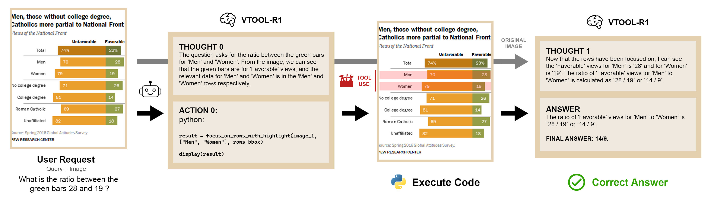

# VTool-R1

This repo contains codes for the paper "VTool-R1: VLMs Learn to Think with Images via Reinforcement Learning on Multimodal Tool Use" accepted at ICLR 2026.

---


[](https://arxiv.org/pdf/2505.19255)
[](https://vtool-r1.github.io/)
[](https://huggingface.co/VTOOL)

# News

- [2026/1/26] VTool-R1 is accepted to [ICLR 2026](https://iclr.cc)! See you in Brazil.  <span style="color: red;">[**New!**]</span>
- [2025/6/18] Updated ArXiv with better results!</span>
- [2025/5/31] Training and eval code available. (We are working on releasing better model checkpoints. Stay Tuned! Disclaimer: the released model checkpoint might not match the latest results) <!--<span style="color: red;">[**New!**]</span>-->
- [2025/5/25] ArXiv preprint available.

### New Version Coming Soon

- A new version of VTool-R1 implemented via Agent Loop on the latest version of verl will be available soon.

# Introduction

We introduce VTool-R1, one of the first frameworks that trains VLMs to generate multimodal chains of thought by interleaving text and intermediate visual reasoning steps. VTool-R1 integrates Python-based visual editing tools into the RFT process, enabling VLMs to learn when and how to generate visual reasoning steps that benefit final reasoning. Trained with outcome-based rewards tied to task accuracy, our approach elicits strategic visual tool use for reasoning without relying on process-based supervision. Experiments on structured visual question answering over charts and tables show that VTool-R1 enhances reasoning performance by teaching VLMs to "think with images" and generate multimodal chain of thoughts with tools.

 Figure 2: Qualitative Example from VTool-R1 (3B): The Model Successfully Integrates Intermediate Visual Steps.

 

VTool-R1 7B achieved a **71.7%** accuracy on the ReFOCUS-TableVQA dataset. Which is **10% higher** than the base accuracy of 64.7% using Qwen2.5-VL.


## Installation

```
conda create -n vtool python=3.10
conda activate vtool
pip install torch==2.5.1 torchvision==0.20.1 torchaudio==2.5.1 --index-url https://download.pytorch.org/whl/cu124
pip install hf_transfer vllm==0.8.3 triton==3.1.0
pip install -e .
```

## Data Preparation (ReFocus)

```
pip install gdown

bash prepare_refocus_data.sh

python chartqa_dataset_creator.py
```

The datasets should be organized into the following structure:

- datasets
  - val_full.parquet
  - train_full.parquet
  - test_full.parquet
  - table_train.parquet
  - table_test.parquet

Alternatively, we provide [preprocessed dataset](https://drive.google.com/drive/folders/16tP_cH-9kGFzjyAn3_z1wo7HQaa9T7MY?usp=share_link) in parquet format.

## Training

Sample training scripts for 3B and 7B are available.

For reference, we trained our 3B models using 8xH100, 7B with 16xH100, both with mixed precision, and 32B with 8 H200 using BF16 precision. You may consider tuning global_batch_size and micro_batch_size_per_device_for_update to reduce VRAM usage. 

Visual tokens for TableQA are often longer, it is recommended to reduce your batch size by half when switching from ChartQA to TableQA.

3B and 7B models require a minimum of 4xH100 and 8xH100 respectively. Training using our specs typically complete within 24 hours.

Due to the nature of our dataset, we used an small LLM as our training verifier. Specifically, Qwen/Qwen2.5-7B-Instruct. We recommend either a single H100 or two A100 for stable training (relative to our training specs, e.g. you may find a single A100 or 4090 sufficient for 4xH100 training). 

You need to first launch the judge using our scripts run_judge.sh and then include your judge host name in judge/judge_info.json. We provide a script judge/test.py to test whether your judge was successfully deployed or not.

By default, the code assumes your judge and training job runs on the same local network, via port 7999. You may change the port if 7999 is taken.

Alternatively, we provide an option to use ngrok (a tunnel service) if your judge server is on a different network, refer to examples/reward_function/refocus_llm.py to configure your ngrok domain. You will also need to set the environment variable NGROK=YES.

If you lack the infrastructure to utilize an LLM judge, you may alternatively resort to an exact string match reward function, which can be done by switching refocus_llm.py to refocus.py in your config script. Note that this will have a negative impact on training performance.

The config is set to 2000 steps, but this is not the actual training time, most training tasks converge within 50-100 steps (< 1-2 days) .

## Questions

Please open an issue if your have any questions.

## Model Use and Evaluation

We provide 3B, 7B, and 32B model weights on ChartQA and TableQA datasets from ReFocus. Download them from [Hugging Face].

Evaluation scripts are in the eval folder. For evaluation, we use ChatGPT from OpenAI as the judge. Please configure your own API keys using environment variables. 

At the moment, we use separate .py scripts for evaluating models under different settings. Please check the table below for the corresponding evaluation script and modify the scripts as needed. 

| Model               | Setting                         | Dataset         | Eval Script                  |
|---------------------|---------------------------------|-----------------|------------------------------|
| Qwen2.5-VL-Instruct | vanilla model, pure run         | ChartQA         | eval_qwen_no_tool.py         |
| Qwen2.5-VL-Instruct | vanilla model, prompt with tool | ChartQA         | eval_qwen_no_rl.py           |
| Qwen2.5-VL-Instruct | vanilla model, pure run         | TableQA         | eval_qwen_tableqa_no_tool.py |
| Qwen2.5-VL-Instruct | vanilla model, prompt with tool | TableQA         | eval_qwen_tableqa_no_rl.py   |
| Qwen2.5-VL-Instruct | trained model, prompt with tool | ChartQA/TableQA | eval_qwen.py                 |
| openai API (GPT-4o) | pure run                        | ChartQA/TableQA | eval_gpt_no_tool.py          |
| openai API (GPT-4o) | prompt with tool                | ChartQA/TableQA | eval_gpt_with_tool.py        |

## Acknowledgement

This research used the Delta advanced computing and data resource which is supported by the National Science Foundation (award OAC 2005572) and the State of Illinois. Delta is a joint effort of the University of Illinois Urbana-Champaign and its National Center for Supercomputing Applications.

We would also like to acknowledge Bowen Jin (author of Search-R1) and Xingyu Fu (author of Refocus) for their valuable suggestions and contributions to our project.

We also thank [veRL](https://github.com/volcengine/verl) and [EasyR1](https://github.com/hiyouga/EasyR1) for providing the essential VLM RL infrastructure.

This work was supported by the National Science Foundation grants NSF CNS 21-06592, NSF OAC 18-35834 KN, NSF CNS 19-00875 and NSF CCF 22-17144. Any results and opinions are our own and do not represent views of National Science Foundation.

## BibTex

If you find our project helpful, please consider citing:

<pre style="background-color: auto; padding: 0.8rem 1rem 0.4rem 1rem; border-radius: 8px; overflow-x: auto; font-size: 0.9rem;">
@misc{wu2025vtoolr1vlmslearnthink,
      title={VTool-R1: VLMs Learn to Think with Images via Reinforcement Learning on Multimodal Tool Use}, 
      author={Mingyuan Wu and Jingcheng Yang and Jize Jiang and Meitang Li and Kaizhuo Yan and Hanchao Yu and Minjia Zhang and Chengxiang Zhai and Klara Nahrstedt},
      year={2025},
      eprint={2505.19255},
      archivePrefix={arXiv},
      primaryClass={cs.LG},
      url={https://arxiv.org/abs/2505.19255}, 
}
</pre>

If you find the dataset helpful, please consider citing Refocus paper:
<pre style="background-color: auto; padding: 0.8rem 1rem 0.4rem 1rem; border-radius: 8px; overflow-x: auto; font-size: 0.9rem;">
@misc{fu2025refocusvisualeditingchain,
      title={ReFocus: Visual Editing as a Chain of Thought for Structured Image Understanding}, 
      author={Xingyu Fu and Minqian Liu and Zhengyuan Yang and John Corring and Yijuan Lu and Jianwei Yang and Dan Roth and Dinei Florencio and Cha Zhang},
      year={2025},
      eprint={2501.05452},
      archivePrefix={arXiv},
      primaryClass={cs.CV},
      url={https://arxiv.org/abs/2501.05452}, 
}
</pre>
